# agents-workflows

[](https://www.npmjs.com/package/agents-workflows)
[](./LICENSE)

Reusable AI agent configuration framework. Install battle-tested Claude Code agents, Codex CLI skills, and workflow commands into any project, adapted to your stack.

## What it does

This CLI tool extracts proven agentic workflow patterns into parameterized templates that adapt to your project's technology stack. Instead of writing agent configurations from scratch, you answer a few questions and get a complete set of:

- **Up to 9 specialized agents**: architect, implementer (one of 13 stack-aware variants), code-reviewer, security-reviewer, code-optimizer, test-writer, e2e-tester, reviewer, ui-designer
- **3 workflow commands**: `/workflow-plan`, `/workflow-fix`, `/external-review`
- **Root config files**: `AGENTS.md`, plus `CLAUDE.md` and `.claude/settings.json` when Claude Code output is selected
- **Sync scripts**: Codex CLI integration with `.codex/` skills and prompts

## Quick start

```bash
npx agents-workflows init
# or
pnpm dlx agents-workflows init
# or
bunx agents-workflows init
```

The CLI will:

1. **Detect** your project stack (language, framework, UI library, database, auth, testing, linting)
2. **Ask** interactive questions for anything it can't detect
3. **Generate** adapted agent configurations in `.claude/agents/`, `.codex/skills/`, and root config files
4. **Write** a manifest (`.agents-workflows.json`) for future updates

## After init — refine the generated agents

`init` (and every subsequent `update`) emits an `AGENTS_REFINE.md` prompt at the project root. This file is the executable handoff you give your agent so the generated agent files under `.claude/agents/` and `.codex/skills/` get tailored to **this** workspace's domain vocabulary, architectural patterns, preferred libraries, and team conventions that the stack detector cannot infer.

The prompt is **planning-only**: per PRD §1.3 fail-safe, the agent audits the generated files and proposes changes — it does not edit anything until you reply `apply`.

```bash
# Claude Code
claude "$(cat AGENTS_REFINE.md)"

# Codex CLI
codex exec "$(cat AGENTS_REFINE.md)"
```

To skip emission (useful for CI that consumes the templates out-of-band), pass `--no-refine-prompt` to either command:

```bash
agents-workflows init --no-refine-prompt
agents-workflows update --no-refine-prompt
```

## Re-running on an existing project

Running `init` or `update` on a project that already has generated files is safe. Before writing any file that already exists, the CLI pauses and asks what to do:

```text
AGENTS.md already exists. Overwrite? [y]es / [n]o / [a]ll / [s]kip-all / [m]erge
```

### Prompt answers

| Answer | Meaning |
|---|---|
| `[y]es` | Overwrite this file. |
| `[n]o` | Skip this file; leave it unchanged. |
| `[a]ll` | Overwrite all remaining conflicting files without further prompts (sticky for the rest of the run). |
| `[s]kip-all` | Skip all remaining conflicting files without further prompts (sticky for the rest of the run). |
| `[m]erge` | Structured merge — only offered for file types that support it (see below). |

### CLI flags

| Flag | Effect |
|---|---|
| `--yes` | Non-interactive: overwrite every conflicting file (equivalent to picking `[a]ll` up front). |
| `--no-prompt` | Non-interactive: skip every conflicting file (equivalent to `[s]kip-all` up front). |
| `--merge-strategy=<keep&#124;overwrite&#124;merge>` | Default action applied automatically to every conflict without prompting. |

### Merge support

| File type | Merge behaviour |
|---|---|
| Markdown (`AGENTS.md`, `CLAUDE.md`, agent prompts, command files) | Structured merge by top-level heading. User-edited sections are preserved. Sections marked `<!-- agents-workflows:managed -->` are updated by the generator. |
| JSON (`.claude/settings.json`, Codex config) | Deep-merge with array union (de-duplicated). User wins on scalar conflicts for non-managed keys. |
| Any other format | Falls back to yes / no / all / skip; no structured merge option is offered. |

### CI usage

- `--yes` — non-interactive, **overwrites every conflicting file** with the latest template output. Use this in CI that wants to refresh generated artefacts on every run.
- `--no-prompt` — non-interactive, **only creates new files**; existing files are left untouched. Use this in CI that bootstraps missing artefacts without disturbing local edits.
- Both exit 0 without reading stdin and are safe for trusted CI on a clean checkout.

> `--non-interactive` (the semi-autonomous mode flag, see [Semi-autonomous non-interactive mode](#semi-autonomous-non-interactive-mode)) is a different feature and is **not** recommended for unattended CI — it is scoped to developer-assisted feature-branch runs only.

## Supported stacks

| Category | Detected |
|---|---|
| Languages | TypeScript, JavaScript, Python, Go, Rust, Java, C# |
| Frameworks | React, Next.js, Expo, React Native, Remix, Vue, Nuxt, SvelteKit, Angular, NestJS, Express, Fastify, Hono, FastAPI, Django, Flask |
| UI Libraries | Tailwind, NativeWind, Tamagui, MUI, Chakra, Mantine, shadcn/ui, Ant Design |
| State | Zustand, Redux, Jotai, Recoil, MobX, Pinia, TanStack Query |
| Databases | Supabase, Prisma, Drizzle, Firebase, Mongoose, TypeORM, Knex, Sequelize, SQLAlchemy, Django ORM, Tortoise ORM |
| Auth | NextAuth/Auth.js, Clerk, Auth0, Supabase Auth, Lucia, Firebase Auth |
| Testing | Jest, Vitest, Mocha, AVA, pytest, Go test |
| E2E | Playwright, Cypress, Maestro, Detox |
| Linters | ESLint, Oxlint, Biome, Ruff |
| Package Managers | npm, pnpm, yarn, bun, pip, pipenv, poetry, uv, go mod |

## Generated agents

| Agent | Role | Model |
|---|---|---|
| `architect` | Planning only; produces structured `PLAN.md` with max 8 tasks | Opus |
| `implementer` | Primary code writing agent — one of 13 stack-aware variants chosen at config time | Sonnet |
| `code-reviewer` | Post-edit review with project-specific checklist | Sonnet |
| `security-reviewer` | OWASP/security audit (injection, auth, secrets, data exposure) | Sonnet |
| `code-optimizer` | Performance, DRY, and quality analysis | Sonnet |
| `test-writer` | Unit test generation (Jest/Vitest/pytest/Go) | Sonnet |
| `e2e-tester` | E2E test generation (Playwright/Cypress/Maestro) | Sonnet |
| `reviewer` | 5-step review loop orchestrator (review, fix, type-check, test, lint) | Sonnet |
| `ui-designer` | UI/UX design system enforcement (frontend only) | Sonnet |

> **Model routing.** The `Model` column above lists Claude defaults that ship today. Where multiple model families are available, the templates are designed to pair the **implementer and reviewer in different families** so each acts as an independent check on the other. Stack-by-stack pairings (TS/React, Python, C++, etc.) are specified in [PRD §1.7 Cross-model external review](./PRD.md#17-cross-model-external-review) and [§1.7.1 Claude + GPT pairing (stack-aware defaults)](./PRD.md#171-claude--gpt-pairing-stack-aware-defaults).

### Stack matrix

| Detected stack | Variant | Notes |
|---|---|---|
| Spring Boot (Java / Kotlin) | `java-spring` | |
| ASP.NET Core (C#) | `dotnet-csharp` | |
| Vue / Nuxt | `vue` | Epic 17 body |
| Angular | `angular` | Epic 17 body |
| SvelteKit | `svelte` | |
| React + TypeScript (incl. Next.js, Remix, Expo, React Native) | `react-ts` | Mobile (Expo, RN) intentionally routes here per Epic 13 non-goals |
| TypeScript + NestJS / Express / Fastify / Hono | `node-ts-backend` | |
| Python (any framework) | `python` | |
| Go | `go` | |
| Rust | `rust` | |
| Plain TypeScript (no framework) | `typescript` | Epic 17 body |
| Plain JavaScript (no framework) | `javascript` | Epic 17 body |
| Unknown / polyglot root | `generic` | Stack-agnostic baseline |

- The emitted filename is always `.claude/agents/implementer.md` and `.codex/skills/implementer/SKILL.md`.
- The active variant is recorded in `.agents-workflows.json` under `agents.implementerVariant`.
- Existing manifests carrying the legacy `reactTsSenior: true` field migrate automatically on first `update` to `implementerVariant: 'react-ts'`.
- Any pre-existing `.claude/agents/react-ts-senior.md` and `.codex/skills/react-ts-senior/SKILL.md` are removed via the Epic 7 safe-delete confirmation flow (`--yes` skips the prompt; backups are written only after deletion is confirmed or prompts are suppressed).

## Workflow patterns

### End-to-end workflow

```mermaid
flowchart TD
    A[1. Author PRD.md / README.md<br/>goals, roadmap, epics] --> B

    B["2. /workflow-plan 'epic description'"]
    B --> B1[architect → PLAN.md<br/>max 8 tagged tasks]
    B1 --> B2[Per-task loop:<br/>implementer / test-writer<br/>+ code-reviewer + security-reviewer]
    B2 --> B3[code-optimizer pass]
    B3 --> B4[Final review loop:<br/>check-types • test • lint]
    B4 --> C

    C[3. Manual review<br/>+ /external-review<br/>default: CodeRabbit CLI]
    C --> C1[QA.md<br/>critical / warning / suggestion]
    C1 --> D

    D[4. /workflow-fix]
    D --> D1[Verify each QA finding<br/>against actual code]
    D1 --> D2[implementer applies fixes<br/>marks QA.md items &#91;x&#93;]
    D2 --> D3[Mandatory review loop:<br/>code-reviewer + security-reviewer<br/>check-types • test • lint]
    D3 --> D4[Mark epic &#91;DONE YYYY-MM-DD&#93;<br/>in PRD.md]
```



1. **Author `PRD.md`** (or `README.md`) with project description, roadmap, goals, and epics — the canonical source of intent that every agent reads before planning.
2. **Run `/workflow-plan "<epic description>"`** — `architect` produces `PLAN.md` (max 8 tagged tasks); each task runs through `implementer` or `test-writer`, then `code-reviewer` + `security-reviewer` in parallel; `code-optimizer` runs once across all modified files; a final loop enforces `pnpm check-types` / `pnpm test` / `pnpm lint` until clean.
3. **Review the code manually, and run `/external-review`** — the configured external review tool (default: CodeRabbit CLI) writes findings to `QA.md`, grouped by file with `[critical]` / `[warning]` / `[suggestion]` tags.
4. **Run `/workflow-fix`** — each `QA.md` item is verified against the actual code, applied by `implementer`, and marked `[x]`; the mandatory review loop (reviewers + `check-types` / `test` / `lint`) runs again; once everything is clean the matching epic in `PRD.md` is stamped `[DONE YYYY-MM-DD]`.

### `/workflow-plan`: End-to-end feature development

1. Branch setup from `main`
2. `architect` agent produces structured `PLAN.md`
3. Execute all tasks with sub-agent routing (UI to `ui-designer` first, tests to `test-writer`, etc.)
4. `code-reviewer` after each task, `code-optimizer` after all tasks
5. `reviewer` orchestrates the final 5-step quality gate

### `/workflow-fix`: Fix QA issues

1. Read `QA.md` findings
2. Verify each finding against actual code
3. Fix verified issues with appropriate sub-agents
4. Run the mandatory review loop

## Updating configurations

After modifying your `.agents-workflows.json` config:

```bash
npx agents-workflows update
```

This re-renders templates, shows a diff for each changed file, and lets you confirm before writing.

Use `--yes` to apply update diffs without the confirmation prompt.

```bash
npx agents-workflows update --yes
```

## Non-interactive usage

Use `--config` to initialize from a complete StackConfig JSON file, or `--yes` to use detected values plus defaults without prompts.

```bash
npx agents-workflows init --config ./agents-workflows.config.json
npx agents-workflows init --yes
```

### Isolation baseline (always asked)

Interactive `init` and `update` always ask **where the agent runs** (devcontainer, docker, vm, vps, clean-machine, host-os) as a documented baseline. The choice is captured in `.agents-workflows.json` under `security.runsIn` even when non-interactive mode stays OFF — knowing whether work happens in a sandbox vs. host-OS shapes every other safety decision. `--isolation=<env>` works as a standalone flag (no `--non-interactive` required); `--yes --isolation=foo` honours the explicit flag.

### Semi-autonomous non-interactive mode

This mode is **opt-in and off by default**. `--yes` alone does NOT enable it — you must also pass `--non-interactive`. Choosing `host-os` as the isolation environment additionally requires `--accept-risks` **when enabling non-interactive** (selecting `host-os` as the baseline alone does not). See PRD §1.9.1 for the full risk disclosure before enabling.

**Canonical invocations (no dangerous bypass flags):**

```bash
# Claude Code — headless
claude -p "Read ./CLAUDE.md and execute every step in order until complete. Do not ask for input."

# Claude Code — headless with logging
claude -p "Read ./CLAUDE.md and execute every step in order until complete. Do not ask for input." --output-format stream-json | tee run.log

# Codex CLI — headless
codex exec "Read ./AGENTS.md and execute every step in order until complete."

# Codex CLI — headless with logging
codex exec --json --ephemeral "Read ./AGENTS.md and execute every step in order until complete." | tee run.log
```

> **`--full-auto` is NOT equivalent to `approval_policy = "never"`.**
> `--full-auto` is a CLI flag with different semantics. This repo only supports config-driven non-interactive mode via `approval_policy = "never"` in `.codex/config.toml` and `"defaultMode": "acceptEdits"` in `.claude/settings.json`, both emitted by `agents-workflows init --non-interactive`. `acceptEdits` auto-approves file edits and the FS commands `mkdir`/`touch`/`mv`/`cp`; **Bash commands still prompt** unless explicitly listed in `permissions.allow`. `bypassPermissions` and `--dangerously-skip-permissions` are forbidden — per the Claude Code permission docs they are the same dangerous mode in two delivery surfaces, blocked together by the managed kill-switch `disableBypassPermissionsMode`.

**Three-stage guard order:**

1. Deny / forbid rules in `.claude/settings.json` and `.codex/rules/project.rules` evaluate **first** — destructive commands are blocked before approval is considered.
2. Approval stage — auto-approved in semi-autonomous mode (no prompts).
3. Sandbox boundary enforcement — `workspace-write` sandbox restricts file writes (subject to PRD §1.9.1 item 10.2 on Windows).

**Scope:** developer-assisted feature-branch runs only. Human `git diff` review is required before any manual commit or push. This is not a claim of unattended CI suitability.

**Per-tool reference:**

| Tool | Headless invocation | Precondition | Forbidden |
|---|---|---|---|
| Claude Code | `claude -p "..."` | `.claude/settings.json` deny rules present (Epic 9); `defaultMode: "acceptEdits"` | `--dangerously-skip-permissions`, `defaultMode: "bypassPermissions"` (same dangerous mode, two surfaces) |
| Codex CLI | `codex exec "..."` | `.codex/rules/project.rules` forbid rules present (Epic 9) | `--dangerously-bypass-approvals-and-sandbox`, `sandbox_mode = "danger-full-access"` |
| Cursor | `cursor-agent --prompt "..."` (or Background Agents) | `.cursor/rules/00-deny-destructive-ops.mdc` present (Epic 9 E9.T6) | `--yolo` |
| VSCode + Copilot | `/workflow-plan` from chat (executes `.github/prompts/workflow-plan.prompt.md`) or assign issue to Copilot coding agent | `tools:` allow-list in prompt frontmatter; GitHub branch protection on `main` | Do NOT set any auto-approve setting |
| Windsurf | Cascade `/workflow-plan` in **Auto** mode (NOT Yolo) | `.windsurf/rules/00-deny-destructive-ops.md` present (Epic 9 E9.T8) | Yolo mode |

**Windsurf Cascade approval mode (PRD §1.9 / Epic 9 E9.T8):** every contributor must run Cascade in **Manual** or **Auto** mode. Yolo mode is forbidden in this repository — it disables every per-command approval and renders the always-on `.windsurf/rules/00-deny-destructive-ops.md` rule advisory-only. The `00-deny-destructive-ops.md` rule and `git push --force` denies do not engage at the kernel level; pair them with branch protection on `main` and a non-Yolo Cascade default.

**Windows caveat (PRD §1.9.1 item 10.2):** Codex `workspace-write` sandbox is unstable on Windows. Treat `.codex/rules/project.rules` as the PRIMARY guard. Prefer devcontainer / WSL2 / VM / GitHub Codespaces for higher trust.

**Host hardening (PRD §1.9.2, all OSes).** Run from the native filesystem (no cross-mount work — no `/mnt/c`, `/Volumes`, or UNC paths), sandbox via `/sandbox` or devcontainer, never run elevated (no `sudo` / Administrator), and on enterprise devices install the org-mandated EDR (Microsoft Defender for Endpoint incl. the WSL plug-in, CrowdStrike Falcon, SentinelOne, etc.) for the host OS.

#### Codex on Windows hosts: WSL2 or devcontainer required

The strict deny rules forbid PowerShell wrappers (E9.T12 — see `.codex/rules/project.rules` and `.claude/settings.json`), and the Codex CLI Windows runtime spawns every command via `powershell.exe -NoProfile -Command '<inner>'`. Together this means **Codex on Windows-native is intentionally unsupported**: the wrapper deny fires before any inner command runs. Use WSL2 or a devcontainer where the Linux runtime invokes commands via direct `execve` and the deny rules apply to the actual command.

```sh
# In Windows PowerShell (one-time, as administrator):
wsl --install -d Ubuntu-22.04

# Inside the Ubuntu shell — clone into the Linux filesystem, NOT /mnt/c
# (PRD §1.9.2 item 11.1: avoid cross-OS access; /mnt/c reads expose
# Windows-side secrets to a prompt-injected agent).
mkdir -p ~/Projects && cd ~/Projects
git clone https://github.com/<your-org>/agents-workflows.git
cd agents-workflows
# Prefer corepack (ships with Node ≥16) over curl-pipe-to-shell — it
# resolves pnpm to a registry-pinned version with integrity verification.
corepack enable
corepack prepare pnpm@latest --activate
pnpm install
# Codex CLI install: follow the Linux instructions from your Codex distribution.
codex
```

Devcontainer alternative: scaffold `.devcontainer/devcontainer.json` based on `mcr.microsoft.com/devcontainers/typescript-node:22` and reopen the workspace in a container. The project does not commit a `.devcontainer/` today.

**Claude Code on Windows-native is supported as-is.** Claude's bash tool calls bash directly (Git Bash / WSL bash), not via a PowerShell wrapper, so the `Bash(powershell:*)` / `Bash(cmd /c:*)` denies cost Claude nothing functionally and remain free defense-in-depth. WSL2 / devcontainer is recommended for Claude when you want the strongest posture, but it is not required to make Claude work.

## What gets written

`AGENTS.md` and `.agents-workflows.json` are emitted on every run regardless of which targets you select. They serve different audiences:

- `AGENTS.md` is the **agent-facing universal instructions surface** emitted for every project. Tools that read it natively can consume it directly, while Claude Code, Codex CLI, Cursor, Copilot, and Windsurf also receive target-native files listed below.
- `.agents-workflows.json` is the **CLI manifest/state surface** emitted by this generator on every run; it tracks the resolved config, hash, and produced file list so internal CLI workflows (`update`, idempotency checks, drift detection) can re-render deterministically. External agents do not consume it.

If `README.md` describes either of these roles differently from the code, flag the mismatch in the PR rather than silently picking one.

### Supported targets

| Tool | Output paths | Activation model | Detection signal |
|---|---|---|---|
| Claude Code | `.claude/agents/*.md`, `.claude/commands/*.md`, `.claude/scripts/*.sh`, `CLAUDE.md`, `.claude/settings.json` | Sub-agents per file; settings deny/allow lists | `claude` CLI on PATH, `~/.claude/`, `ANTHROPIC_API_KEY` |
| Codex CLI | `.codex/config.toml`, `.codex/rules/project.rules`, `.codex/skills/*/SKILL.md`, `.codex/prompts/*.md`, `.codex/scripts/sync-codex.{sh,ps1}` | Skill files + project.rules deny/forbid | `codex` CLI on PATH, `~/.codex/config.toml`, `OPENAI_API_KEY` |
| Cursor | `.cursor/rules/NN-<slug>.mdc`, `.cursor/commands/*.md` | MDC frontmatter (`alwaysApply`, `globs`, `description`); ordered `00-` always-on, `10-` glob, `20-` model-decision, `30-` manual | `cursor` CLI on PATH, `~/.cursor/` |
| VSCode + GitHub Copilot | `.github/copilot-instructions.md`, `.github/prompts/*.prompt.md` | Single advisory instructions file + per-prompt YAML `tools:` allow-list | `copilot` CLI on PATH, `.github/` directory present, `GH_TOKEN`/`GITHUB_TOKEN` |
| Windsurf | `.windsurf/rules/NN-<slug>.md`, `.windsurf/workflows/*.md` | YAML `activation:` header (`always_on`, `glob`, `model_decision`, `manual`); same ordering as Cursor | `windsurf` CLI on PATH, `~/.codeium/windsurf/` |

GitHub branch protection (disallow force-push, require review) is the server-side backstop for the Copilot coding agent because client-side guards in `.github/copilot-instructions.md` and the `tools:` frontmatter are advisory. Cursor and Windsurf have no kernel sandbox; their always-on rules are agent-behaviour guidance, not enforcement.

## Project structure

### Top-level layout

```text
agents-workflows/
├── src/                        TypeScript source (CLI, detectors, generators, templates)
├── tests/                      Jest test suite mirroring src/
├── scripts/                    Build scripts
├── temp-templates/             Experimental EJS staging area (not shipped)
├── dist/                       Compiled JS output (gitignored)
├── .claude/                    Generated Claude Code workspace (init was run on this repo)
├── .codex/                     Generated Codex CLI workspace (init was run on this repo)
├── .agents-workflows-backup/   Auto-backup created before write-over
├── .agents-workflows.json      Manifest: version, config hash, generated file list
├── package.json                Bin entry (`agents-workflows` → dist/index.js), deps
├── tsconfig.json               TypeScript compiler config
├── tsconfig.build.json         Build-only TypeScript overrides
├── jest.config.js              Jest + ts-jest ESM preset
├── PRD.md                      Canonical product requirements (source of truth)
├── PLAN.md                     Active task breakdown for current work
├── QA.md                       QA findings consumed by /workflow-fix
├── CLAUDE.md                   Claude Code project instructions (generated)
├── AGENTS.md                   Cross-agent project instructions (generated)
├── LICENSE                     Apache-2.0
└── README.md                   This file
```

### `src/` subsystems

| Folder | Purpose | Files |
|---|---|---|
| `src/` | CLI entry point | `index.ts` (shebang, invokes the CLI) |
| `src/cli/` | Commander.js command layer | `index.ts`, `init-command.ts`, `update-command.ts`, `list-command.ts` |
| `src/detector/` | Parallel stack detection | `index.ts`, `types.ts`, `detect-stack.ts` (orchestrator), `detect-language.ts`, `detect-framework.ts`, `detect-ui-library.ts`, `detect-database.ts`, `detect-testing.ts`, `detect-e2e.ts`, `detect-linter.ts`, `detect-state-management.ts`, `detect-package-manager.ts`, `detect-auth.ts`, `detect-ai-agents.ts`, `detect-monorepo.ts`, `detect-docs-file.ts`, `dependency-detector.ts` |
| `src/schema/` | Zod schemas & types | `index.ts`, `stack-config.ts` (user config), `manifest.ts` (generated manifest) |
| `src/prompt/` | Inquirer-based Q&A flow | `index.ts`, `prompt-flow.ts`, `questions.ts`, `defaults.ts`, `install-scope.ts`, `types.ts` |
| `src/generator/` | EJS rendering + context building | `index.ts`, `types.ts`, `build-context.ts`, `generate-agents.ts`, `generate-commands.ts`, `generate-root-config.ts`, `generate-scripts.ts`, `review-checklist-rules.ts`, `permissions.ts` |
| `src/installer/` | File I/O with backup & diff | `index.ts`, `write-files.ts`, `backup.ts`, `diff-files.ts` |
| `src/constants/` | Static lookup tables | `frameworks.ts` (framework metadata: isReact, isMobile, isFrontend) |
| `src/utils/` | Shared helpers | `index.ts`, `logger.ts`, `file-exists.ts`, `read-package-json.ts`, `read-pyproject-toml.ts`, `template-renderer.ts` |

### `src/templates/` — EJS asset library

All generated output starts as an `.ejs` file here. Five categories:

| Category | Contents |
|---|---|
| `agents/` | `architect.md.ejs`, `implementer-variants/<variant>.md.ejs` (13 stack-aware variants), `code-reviewer.md.ejs`, `security-reviewer.md.ejs`, `code-optimizer.md.ejs`, `test-writer.md.ejs`, `e2e-tester.md.ejs`, `reviewer.md.ejs`, `ui-designer.md.ejs` |
| `commands/` | `workflow-plan.md.ejs`, `workflow-fix.md.ejs`, `external-review.md.ejs` |
| `config/` | `AGENTS.md.ejs`, `CLAUDE.md.ejs`, `codex-config.toml.ejs`, `settings.json.ejs`, `codex-project-rules.ejs` |
| `partials/` | Reusable context blocks included by agents/commands: `code-style`, `context-budget`, `definition-of-done`, `dry-rules`, `error-handling-self`, `fail-safe`, `file-organization`, `git-rules`, `review-checklist`, `stack-context`, `tdd-discipline`, `testing-patterns`, `tool-use-discipline`, `untrusted-content`, `workspaces`, `docs-reference` |
| `scripts/` | `sync-codex.sh.ejs`, `sync-codex.ps1.ejs`, `run-parallel.sh.ejs`, `cursor-task.sh.ejs` |

### `tests/` layout

Jest suite mirrors `src/` one-to-one.

| Folder | Covers |
|---|---|
| `tests/cli/` | CLI commands (`list-command.test.ts`) |
| `tests/detector/` | Stack detection: `detect-auth`, `detect-language`, `detect-ai-agents`, `detect-docs-file`, `detect-monorepo`, `detect-stack` (+ `__snapshots__/`) |
| `tests/generator/` | Generation + rule coverage: `build-context`, `generate-all`, `epic-1-safety`, `epic-2-quality`, `permissions`, `review-checklist`, `security-reviewer`, plus `fixtures.ts` shared data |
| `tests/installer/` | Backup behaviour (`backup.test.ts`) |
| `tests/prompt/` | Prompt flow (`prompt-flow.test.ts`) |
| `tests/schema/` | Zod validation (`stack-config.test.ts`) |
| `tests/fixtures/` | Sample projects for detection: `nextjs-app/`, `react-native-expo/`, `python-fastapi/` |

### Generated workspaces in the repo

`.claude/` and `.codex/` are committed because this project runs `init` against itself — contributors see the exact output users would get.

| Path | Contents |
|---|---|
| `.claude/agents/` | `architect.md`, `implementer.md`, `code-reviewer.md`, `security-reviewer.md`, `code-optimizer.md`, `test-writer.md`, `reviewer.md`, `ui-designer.md` |
| `.claude/commands/` | `workflow-plan.md`, `workflow-fix.md`, `external-review.md` |
| `.claude/scripts/` | `run-parallel.sh`, `cursor-task.sh` |
| `.claude/scratchpad/` | Per-task working notes (ephemeral) |
| `.claude/settings.json` | Shared project-scoped permissions (tracked; per-developer overrides go in `settings.local.json`, gitignored) |
| `.codex/skills/<agent>/SKILL.md` | One SKILL.md per agent |
| `.codex/prompts/` | `workflow-plan.md`, `workflow-fix.md`, `external-review.md` |
| `.codex/scripts/` | `sync-codex.sh`, `sync-codex.ps1` |
| `.codex/config.toml` | Codex skill/prompt registry |
| `.codex/rules/project.rules` | Project-scoped Codex policy rules (forbid/allow) |

### Other top-level folders

| Path | Purpose |
|---|---|
| `scripts/build.mjs` | Node build script invoked by `pnpm build` |
| `temp-templates/` | Experimental EJS staging; not consumed by the generator |
| `dist/` | Compiled output produced by `pnpm build` (gitignored) |
| `.agents-workflows-backup/` | Snapshot of previous `.claude/` and `.codex/` written automatically before each overwrite |

## Generated example

Generated agents include stack context and shared rules. For example, `.claude/agents/implementer.md` starts with frontmatter and a role-specific prompt:

```markdown
---
name: implementer
description: "Senior implementation agent adapted to the detected project stack."
model: sonnet
color: green
---

You are a senior **nextjs / typescript** implementation agent for the `my-project` project.
```

## Customization

Generated files use marker comments to separate managed and custom sections:

```markdown
<!-- agents-workflows:managed-start -->
... auto-generated content ...
<!-- agents-workflows:managed-end -->

## Your Custom Rules
... add project-specific rules here, preserved across updates ...
```

## CLI commands

```bash
agents-workflows init      # Detect stack + generate configurations
agents-workflows update    # Re-generate from .agents-workflows.json
agents-workflows list      # Show available agents and commands
```

## Development

```bash
pnpm install
pnpm check-types    # TypeScript compiler check
pnpm lint           # Run Oxlint
pnpm test           # Run Jest tests
pnpm build          # Build to dist/
```

## License

Apache-2.0
