# agents-workflows

[](https://www.npmjs.com/package/agents-workflows)
[](./LICENSE)

Reusable AI agent configuration framework. Install battle-tested Claude Code agents, Codex CLI skills, and workflow commands into any project, adapted to your stack.

## What it does

This CLI tool extracts proven agentic workflow patterns into parameterized templates that adapt to your project's technology stack. Instead of writing agent configurations from scratch, you answer a few questions and get a complete set of:

- **Up to 10 specialized agents**: architect, implementer, react-ts-senior (React + TypeScript stacks only), code-reviewer, security-reviewer, code-optimizer, test-writer, e2e-tester, reviewer, ui-designer
- **3 workflow commands**: `/workflow-plan`, `/workflow-fix`, `/external-review`
- **Root config files**: `AGENTS.md`, plus `CLAUDE.md` and `.claude/settings.local.json` when Claude Code output is selected
- **Sync scripts**: Codex CLI integration with `.codex/` skills and prompts

## Quick start

```bash
npx agents-workflows init
# or
pnpm dlx agents-workflows init
# or
bunx agents-workflows init
```

The CLI will:

1. **Detect** your project stack (language, framework, UI library, database, auth, testing, linting)
2. **Ask** interactive questions for anything it can't detect
3. **Generate** adapted agent configurations in `.claude/agents/`, `.codex/skills/`, and root config files
4. **Write** a manifest (`.agents-workflows.json`) for future updates

## Re-running on an existing project

Running `init` or `update` on a project that already has generated files is safe. Before writing any file that already exists, the CLI pauses and asks what to do:

```text
AGENTS.md already exists. Overwrite? [y]es / [n]o / [a]ll / [s]kip-all / [m]erge
```

### Prompt answers

| Answer | Meaning |
|---|---|
| `[y]es` | Overwrite this file. |
| `[n]o` | Skip this file; leave it unchanged. |
| `[a]ll` | Overwrite all remaining conflicting files without further prompts (sticky for the rest of the run). |
| `[s]kip-all` | Skip all remaining conflicting files without further prompts (sticky for the rest of the run). |
| `[m]erge` | Structured merge — only offered for file types that support it (see below). |

### CLI flags

| Flag | Effect |
|---|---|
| `--yes` | Non-interactive: overwrite every conflicting file (equivalent to picking `[a]ll` up front). |
| `--no-prompt` | Non-interactive: skip every conflicting file (equivalent to `[s]kip-all` up front). |
| `--merge-strategy=<keep&#124;overwrite&#124;merge>` | Default action applied automatically to every conflict without prompting. |

### Merge support

| File type | Merge behaviour |
|---|---|
| Markdown (`AGENTS.md`, `CLAUDE.md`, agent prompts, command files) | Structured merge by top-level heading. User-edited sections are preserved. Sections marked `<!-- agents-workflows:managed -->` are updated by the generator. |
| JSON (`.claude/settings.local.json`, Codex config) | Deep-merge with array union (de-duplicated). User wins on scalar conflicts for non-managed keys. |
| Any other format | Falls back to yes / no / all / skip; no structured merge option is offered. |

### CI usage

For CI, use `--yes` to accept all changes or `--no-prompt` to only create new files and skip existing ones; both exit 0 without reading stdin.

## Supported stacks

| Category | Detected |
|---|---|
| Languages | TypeScript, JavaScript, Python, Go, Rust, Java, C# |
| Frameworks | React, Next.js, Expo, React Native, Remix, Vue, Nuxt, SvelteKit, Angular, NestJS, Express, Fastify, Hono, FastAPI, Django, Flask |
| UI Libraries | Tailwind, NativeWind, Tamagui, MUI, Chakra, Mantine, shadcn/ui, Ant Design |
| State | Zustand, Redux, Jotai, Recoil, MobX, Pinia, TanStack Query |
| Databases | Supabase, Prisma, Drizzle, Firebase, Mongoose, TypeORM, Knex, Sequelize, SQLAlchemy, Django ORM, Tortoise ORM |
| Auth | NextAuth/Auth.js, Clerk, Auth0, Supabase Auth, Lucia, Firebase Auth |
| Testing | Jest, Vitest, Mocha, AVA, pytest, Go test |
| E2E | Playwright, Cypress, Maestro, Detox |
| Linters | ESLint, Oxlint, Biome, Ruff |
| Package Managers | npm, pnpm, yarn, bun, pip, pipenv, poetry, uv, go mod |

## Generated agents

| Agent | Role | Model |
|---|---|---|
| `architect` | Planning only; produces structured `PLAN.md` with max 8 tasks | Opus |
| `implementer` | Primary code writing agent adapted to your stack | Sonnet |
| `react-ts-senior` | Senior React + TypeScript implementation agent (enabled only for React stacks on TypeScript) | Sonnet |
| `code-reviewer` | Post-edit review with project-specific checklist | Sonnet |
| `security-reviewer` | OWASP/security audit (injection, auth, secrets, data exposure) | Sonnet |
| `code-optimizer` | Performance, DRY, and quality analysis | Sonnet |
| `test-writer` | Unit test generation (Jest/Vitest/pytest/Go) | Sonnet |
| `e2e-tester` | E2E test generation (Playwright/Cypress/Maestro) | Sonnet |
| `reviewer` | 5-step review loop orchestrator (review, fix, type-check, test, lint) | Sonnet |
| `ui-designer` | UI/UX design system enforcement (frontend only) | Sonnet |

## Workflow patterns

### End-to-end workflow

```mermaid
flowchart TD
    A[1. Author PRD.md / README.md<br/>goals, roadmap, epics] --> B

    B["2. /workflow-plan &quot;epic description&quot;"]
    B --> B1[architect &rarr; PLAN.md<br/>max 8 tagged tasks]
    B1 --> B2[Per-task loop:<br/>implementer / test-writer<br/>+ code-reviewer + security-reviewer]
    B2 --> B3[code-optimizer pass]
    B3 --> B4[Final review loop:<br/>check-types &bull; test &bull; lint]
    B4 --> C

    C[3. Manual review<br/>+ /external-review &#40;CodeRabbit&#41;]
    C --> C1[QA.md<br/>critical / warning / suggestion]
    C1 --> D

    D[4. /workflow-fix]
    D --> D1[Verify each QA finding<br/>against actual code]
    D1 --> D2[implementer applies fixes<br/>marks QA.md items &#91;x&#93;]
    D2 --> D3[Mandatory review loop:<br/>code-reviewer + security-reviewer<br/>check-types &bull; test &bull; lint]
    D3 --> D4[Mark epic &#91;DONE YYYY-MM-DD&#93;<br/>in PRD.md]
```



1. **Author `PRD.md`** (or `README.md`) with project description, roadmap, goals, and epics — the canonical source of intent that every agent reads before planning.
2. **Run `/workflow-plan "<epic description>"`** — `architect` produces `PLAN.md` (max 8 tagged tasks); each task runs through `implementer` or `test-writer`, then `code-reviewer` + `security-reviewer` in parallel; `code-optimizer` runs once across all modified files; a final loop enforces `pnpm check-types` / `pnpm test` / `pnpm lint` until clean.
3. **Review the code manually, and run `/external-review`** — CodeRabbit writes findings to `QA.md`, grouped by file with `[critical]` / `[warning]` / `[suggestion]` tags.
4. **Run `/workflow-fix`** — each `QA.md` item is verified against the actual code, applied by `implementer`, and marked `[x]`; the mandatory review loop (reviewers + `check-types` / `test` / `lint`) runs again; once everything is clean the matching epic in `PRD.md` is stamped `[DONE YYYY-MM-DD]`.

### `/workflow-plan`: End-to-end feature development

1. Branch setup from `main`
2. `architect` agent produces structured `PLAN.md`
3. Execute all tasks with sub-agent routing (UI to `ui-designer` first, tests to `test-writer`, etc.)
4. `code-reviewer` after each task, `code-optimizer` after all tasks
5. `reviewer` orchestrates the final 5-step quality gate

### `/workflow-fix`: Fix QA issues

1. Read `QA.md` findings
2. Verify each finding against actual code
3. Fix verified issues with appropriate sub-agents
4. Run the mandatory review loop

## Updating configurations

After modifying your `.agents-workflows.json` config:

```bash
npx agents-workflows update
```

This re-renders templates, shows a diff for each changed file, and lets you confirm before writing.

Use `--yes` to apply update diffs without the confirmation prompt.

```bash
npx agents-workflows update --yes
```

## Non-interactive usage

Use `--config` to initialize from a complete StackConfig JSON file, or `--yes` to use detected values plus defaults without prompts.

```bash
npx agents-workflows init --config ./agents-workflows.config.json
npx agents-workflows init --yes
```

## What gets written

| Target | Output paths |
|---|---|
| Always | `AGENTS.md`, `.agents-workflows.json` |
| Claude Code | `.claude/agents/*.md`, `.claude/commands/*.md`, `.claude/scripts/*.sh`, `CLAUDE.md`, `.claude/settings.local.json` |
| Codex CLI | `.codex/skills/*/SKILL.md`, `.codex/prompts/*.md`, `.codex/scripts/sync-codex.sh`, `.codex/scripts/sync-codex.ps1` |

## Project structure

### Top-level layout

```
agents-workflows/
├── src/                        TypeScript source (CLI, detectors, generators, templates)
├── tests/                      Jest test suite mirroring src/
├── scripts/                    Build scripts
├── temp-templates/             Experimental EJS staging area (not shipped)
├── dist/                       Compiled JS output (gitignored)
├── .claude/                    Generated Claude Code workspace (init was run on this repo)
├── .codex/                     Generated Codex CLI workspace (init was run on this repo)
├── .agents-workflows-backup/   Auto-backup created before write-over
├── .agents-workflows.json      Manifest: version, config hash, generated file list
├── package.json                Bin entry (`agents-workflows` → dist/index.js), deps
├── tsconfig.json               TypeScript compiler config
├── tsconfig.build.json         Build-only TypeScript overrides
├── jest.config.js              Jest + ts-jest ESM preset
├── PRD.md                      Canonical product requirements (source of truth)
├── PLAN.md                     Active task breakdown for current work
├── QA.md                       QA findings consumed by /workflow-fix
├── CLAUDE.md                   Claude Code project instructions (generated)
├── AGENTS.md                   Cross-agent project instructions (generated)
├── LICENSE                     Apache-2.0
└── README.md                   This file
```

### `src/` subsystems

| Folder | Purpose | Files |
|---|---|---|
| `src/` | CLI entry point | `index.ts` (shebang, invokes the CLI) |
| `src/cli/` | Commander.js command layer | `index.ts`, `init-command.ts`, `update-command.ts`, `list-command.ts` |
| `src/detector/` | Parallel stack detection | `index.ts`, `types.ts`, `detect-stack.ts` (orchestrator), `detect-language.ts`, `detect-framework.ts`, `detect-ui-library.ts`, `detect-database.ts`, `detect-testing.ts`, `detect-e2e.ts`, `detect-linter.ts`, `detect-state-management.ts`, `detect-package-manager.ts`, `detect-auth.ts`, `detect-ai-agents.ts`, `detect-monorepo.ts`, `detect-docs-file.ts`, `dependency-detector.ts` |
| `src/schema/` | Zod schemas & types | `index.ts`, `stack-config.ts` (user config), `manifest.ts` (generated manifest) |
| `src/prompt/` | Inquirer-based Q&A flow | `index.ts`, `prompt-flow.ts`, `questions.ts`, `defaults.ts`, `install-scope.ts`, `types.ts` |
| `src/generator/` | EJS rendering + context building | `index.ts`, `types.ts`, `build-context.ts`, `generate-agents.ts`, `generate-commands.ts`, `generate-root-config.ts`, `generate-scripts.ts`, `review-checklist-rules.ts`, `permissions.ts` |
| `src/installer/` | File I/O with backup & diff | `index.ts`, `write-files.ts`, `backup.ts`, `diff-files.ts` |
| `src/constants/` | Static lookup tables | `frameworks.ts` (framework metadata: isReact, isMobile, isFrontend) |
| `src/utils/` | Shared helpers | `index.ts`, `logger.ts`, `file-exists.ts`, `read-package-json.ts`, `read-pyproject-toml.ts`, `template-renderer.ts` |

### `src/templates/` — EJS asset library

All generated output starts as an `.ejs` file here. Five categories:

| Category | Contents |
|---|---|
| `agents/` | `architect.md.ejs`, `implementer.md.ejs`, `react-ts-senior.md.ejs`, `code-reviewer.md.ejs`, `security-reviewer.md.ejs`, `code-optimizer.md.ejs`, `test-writer.md.ejs`, `e2e-tester.md.ejs`, `reviewer.md.ejs`, `ui-designer.md.ejs` |
| `commands/` | `workflow-plan.md.ejs`, `workflow-fix.md.ejs`, `external-review.md.ejs` |
| `config/` | `AGENTS.md.ejs`, `CLAUDE.md.ejs`, `codex-config.toml.ejs`, `settings-local.json.ejs` |
| `partials/` | Reusable context blocks included by agents/commands: `code-style`, `context-budget`, `definition-of-done`, `dry-rules`, `error-handling-self`, `fail-safe`, `file-organization`, `git-rules`, `review-checklist`, `stack-context`, `tdd-discipline`, `testing-patterns`, `tool-use-discipline`, `untrusted-content`, `workspaces`, `docs-reference` |
| `scripts/` | `sync-codex.sh.ejs`, `sync-codex.ps1.ejs`, `run-parallel.sh.ejs`, `cursor-task.sh.ejs` |

### `tests/` layout

Jest suite mirrors `src/` one-to-one.

| Folder | Covers |
|---|---|
| `tests/cli/` | CLI commands (`list-command.test.ts`) |
| `tests/detector/` | Stack detection: `detect-auth`, `detect-language`, `detect-ai-agents`, `detect-docs-file`, `detect-monorepo`, `detect-stack` (+ `__snapshots__/`) |
| `tests/generator/` | Generation + rule coverage: `build-context`, `generate-all`, `epic-1-safety`, `epic-2-quality`, `permissions`, `review-checklist`, `security-reviewer`, plus `fixtures.ts` shared data |
| `tests/installer/` | Backup behaviour (`backup.test.ts`) |
| `tests/prompt/` | Prompt flow (`prompt-flow.test.ts`) |
| `tests/schema/` | Zod validation (`stack-config.test.ts`) |
| `tests/fixtures/` | Sample projects for detection: `nextjs-app/`, `react-native-expo/`, `python-fastapi/` |

### Generated workspaces in the repo

`.claude/` and `.codex/` are committed because this project runs `init` against itself — contributors see the exact output users would get.

| Path | Contents |
|---|---|
| `.claude/agents/` | `architect.md`, `implementer.md`, `code-reviewer.md`, `security-reviewer.md`, `code-optimizer.md`, `test-writer.md`, `reviewer.md`, `ui-designer.md` |
| `.claude/commands/` | `workflow-plan.md`, `workflow-fix.md`, `external-review.md` |
| `.claude/scripts/` | `run-parallel.sh`, `cursor-task.sh` |
| `.claude/scratchpad/` | Per-task working notes (ephemeral) |
| `.claude/settings.local.json` | Project-scoped permissions |
| `.codex/skills/<agent>/SKILL.md` | One SKILL.md per agent |
| `.codex/prompts/` | `workflow-plan.md`, `workflow-fix.md`, `external-review.md` |
| `.codex/scripts/` | `sync-codex.sh`, `sync-codex.ps1` |
| `.codex/config.toml` | Codex skill/prompt registry |

### Other top-level folders

| Path | Purpose |
|---|---|
| `scripts/build.mjs` | Node build script invoked by `pnpm build` |
| `temp-templates/` | Experimental EJS staging; not consumed by the generator |
| `dist/` | Compiled output produced by `pnpm build` (gitignored) |
| `.agents-workflows-backup/` | Snapshot of previous `.claude/` and `.codex/` written automatically before each overwrite |

## Generated example

Generated agents include stack context and shared rules. For example, `.claude/agents/implementer.md` starts with frontmatter and a role-specific prompt:

```markdown
---
name: implementer
description: "Senior implementation agent adapted to the detected project stack."
model: sonnet
color: green
---

You are a senior **nextjs / typescript** implementation agent for the `my-project` project.
```

## Customization

Generated files use marker comments to separate managed and custom sections:

```markdown
<!-- agents-workflows:managed-start -->
... auto-generated content ...
<!-- agents-workflows:managed-end -->

## Your Custom Rules
... add project-specific rules here, preserved across updates ...
```

## CLI commands

```bash
agents-workflows init      # Detect stack + generate configurations
agents-workflows update    # Re-generate from .agents-workflows.json
agents-workflows list      # Show available agents and commands
```

## Development

```bash
pnpm install
pnpm check-types    # TypeScript compiler check
pnpm lint           # Run Oxlint
pnpm test           # Run Jest tests
pnpm build          # Build to dist/
```

## License

Apache-2.0
